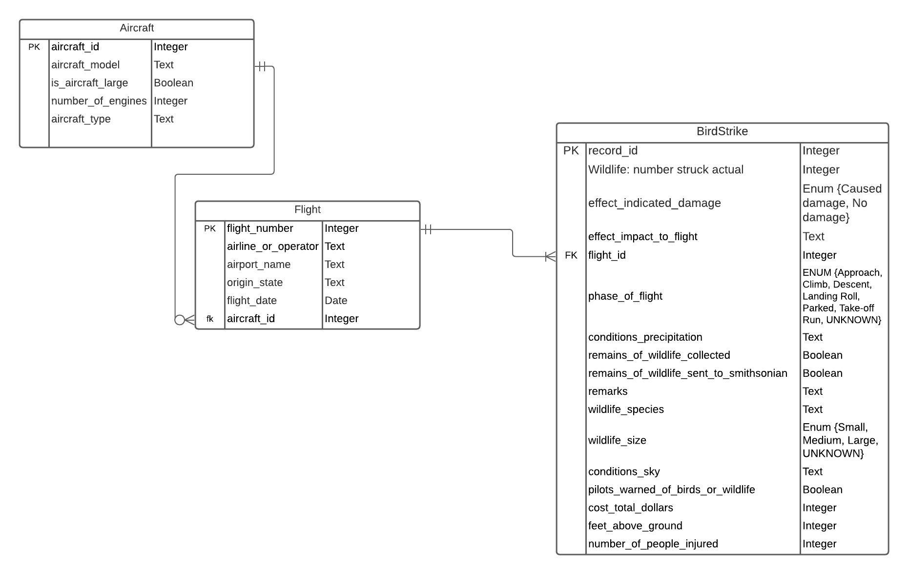

#
Author Emails:
Ian Yip: yip.i@northeastern.edu
Mitchell Lawson: lawson.mi@northeastern.edu

## Notes:
We named our database practicum and some of the sql statements in our queries use the practicum.table_name syntax.
Some of the results are limited to the first x amount of rows due to space considerations after discussing the Professor.

## Import packages
```{r}
library(tidyverse)
library(RMySQL)
library(RSQLite)
library(sqldf)
```
# Question 1
Notes: bird_size and bird species are not related. There were birds of one species that were multiple sizes.


# Question 2
## Database connection
```{r}
dbcon <- dbConnect(RMySQL::MySQL(), user='newuser', password = 'test',
                   dbname = 'practicum', host = 'localhost')

```


```{sql connection=dbcon}
DROP TABLE IF EXISTS bird_strike;
```


```{sql connection=dbcon}
DROP TABLE IF EXISTS flight;
```

```{sql connection=dbcon}
DROP TABLE IF EXISTS aircraft;
```


## Create table
Here are the data definition statements.

## Aircraft table.
```{sql connection=dbcon}
CREATE TABLE aircraft(
  aircraft_id INTEGER PRIMARY KEY UNIQUE,
  aircraft_model varchar(250) DEFAULT "UNKNOWN" NOT NULL,
  aircraft_type TEXT,
  is_aircraft_large BOOL,
  number_of_engines INTEGER
);
```


## Flight table.
```{sql connection=dbcon}
CREATE TABLE flight(
  flight_id INTEGER,
  airport_name VARCHAR(250) DEFAULT 'UNKNOWN',
  airline_or_operator VARCHAR(250) DEFAULT 'UNKNOWN' NOT NULL,
  origin_state VARCHAR(250) DEFAULT 'N/A' NOT NULL,
  aircraft_id INTEGER  NOT NULL,
  flight_date DATE,
  PRIMARY KEY (flight_id),
  FOREIGN KEY(aircraft_id) REFERENCES aircraft(aircraft_id)
);
```


## Bird Strike table.
Did not include altitude bin or number_hit since they can be derived from feet above ground and number_hit_actual.
```{sql connection=dbcon}
CREATE TABLE bird_strike(
  record_id INTEGER,
  wildlife_number_struck_actual INTEGER,
  effect_to_flight TEXT,
  effect_indicated_damage Enum ("Caused damage", "No damage", "UNKNOWN") NOT NULL,
  phase_of_flight ENUM ("Approach", "Climb", "Descent", "Landing Roll", "Parked", "Take-off run", "Taxi", "UNKNOWN") NOT NULL,
  conditions_precipitation TEXT,
  remains_of_wildlife_collected BOOL,
  remains_of_wildlife_sent_to_smithsonian BOOL,
  remarks TEXT,
  wildlife_species TEXT,
  wildlife_size ENUM ("Small", "Medium", "Large", "UNKNOWN") NOT NULL,
  conditions_sky TEXT,
  pilot_warned_of_birds_or_wildlife BOOL,
  cost_total_dollars INTEGER,
  feet_above_ground INTEGER,
  number_of_people_injured INTEGER,
  flight_id INTEGER NOT NULL,
  PRIMARY KEY (record_id),
  FOREIGN KEY(flight_id) REFERENCES flight(flight_id)
);

```

# Question 3
## Importing the csv file.

```{r}
birdStrikesData <- read.csv(file.path("~/Google\ Drive/Northeastern\ University/CS5200/Practicum/BirdStrikesData.csv"), header=TRUE, na.strings=c(""," ", "NA"))

```

## Renaming the headers.
Dots in the headers of columns are not very easy to work with SQL or in R.
Rename them here.
```{r}
names(birdStrikesData)[names(birdStrikesData) == "Record.ID"] <- "record_id"

names(birdStrikesData)[names(birdStrikesData) == "Wildlife..Number.struck"] <- "wildlife_number_struck"

names(birdStrikesData)[names(birdStrikesData) == "Wildlife..Number.Struck.Actual"] <- "wildlife_number_struck_actual"

names(birdStrikesData)[names(birdStrikesData) == "Aircraft..Make.Model"] <- "aircraft_model"

names(birdStrikesData)[names(birdStrikesData) == "Aircraft..Type"] <- "aircraft_type"
names(birdStrikesData)[names(birdStrikesData) == "Aircraft..Number.of.engines."] <- "number_of_engines"

names(birdStrikesData)[names(birdStrikesData) == "Is.Aircraft.Large."] <- "is_aircraft_large"

names(birdStrikesData)[names(birdStrikesData) == "Wildlife..Species"] <- "wildlife_species"

names(birdStrikesData)[names(birdStrikesData) == "Wildlife..Size"] <- "wildlife_size"

names(birdStrikesData)[names(birdStrikesData) == "FlightDate"] <- "flight_date"

names(birdStrikesData)[names(birdStrikesData) == "Airport..Name"] <- "airport_name"

names(birdStrikesData)[names(birdStrikesData) == "Origin.State"] <- "origin_state"
names(birdStrikesData)[names(birdStrikesData) == "Aircraft..Airline.Operator"] <- "airline_or_operator"

names(birdStrikesData)[names(birdStrikesData) == "Effect..Impact.to.flight"] <- "effect_to_flight"

names(birdStrikesData)[names(birdStrikesData) == "Effect..Indicated.Damage"] <- "effect_indicated_damage"

names(birdStrikesData)[names(birdStrikesData) == "When..Phase.of.flight"] <- "phase_of_flight"

names(birdStrikesData)[names(birdStrikesData) == "Remains.of.wildlife.collected."] <- "remains_of_wildlife_collected"

names(birdStrikesData)[names(birdStrikesData) == "Remains.of.wildlife.sent.to.Smithsonian"] <- "remains_of_wildlife_sent_to_smithsonian"


names(birdStrikesData)[names(birdStrikesData) == "Conditions..Sky"] <- "conditions_sky"

names(birdStrikesData)[names(birdStrikesData) == "Conditions..Precipitation"] <- "conditions_precipitation"

names(birdStrikesData)[names(birdStrikesData) == "Pilot.warned.of.birds.or.wildlife."] <- "pilot_warned_of_birds_or_wildlife"
names(birdStrikesData)[names(birdStrikesData) == "Cost..Total.."] <- "cost_total_dollars"

names(birdStrikesData)[names(birdStrikesData) == "Feet.above.ground"] <- "feet_above_ground"
names(birdStrikesData)[names(birdStrikesData) == "Number.of.people.injured"] <- "number_of_people_injured"
names(birdStrikesData)[names(birdStrikesData) == "Remarks"] <- "remarks"


head(birdStrikesData)
```

## Sentinel Values 
Replaces null values.
This allows queries to be slightly more simple since they don't have to deal with null values for these columns. This is also useful for group by since "UNKNOWN" will show up where null values would be ignored.
Also, you can set the value for these columns as not null.
```{r}

birdStrikesData$airline_or_operator[is.na(birdStrikesData$airline_or_operator)] <- "UNKNOWN"

birdStrikesData$aircraft_model[is.na(birdStrikesData$aircraft_model)] <- "UNKNOWN"

birdStrikesData$airport_name[is.na(birdStrikesData$airport_name)] <- "UNKNOWN"

birdStrikesData$airport_name[is.na(birdStrikesData$wildlife_size)] <- "UNKNOWN"
birdStrikesData$airport_name[is.na(birdStrikesData$phase_of_flight)] <- "UNKNOWN"
birdStrikesData$airport_name[is.na(birdStrikesData$effect_indicated_damage)] <- "UNKNOWN"
birdStrikesData$airport_name[is.na(birdStrikesData$effect_to_flight)] <- "UNKNOWN"

```


## Change true or false/ yes or no values to 1 and 0. 
MySql deals with boolean values as tiny int's. Makes it easier to write to table and import.
```{r}
birdStrikesData$is_aircraft_large[birdStrikesData$is_aircraft_large=='Yes'] <- 1
birdStrikesData$is_aircraft_large[birdStrikesData$is_aircraft_large=='No'] <- 0

birdStrikesData$remains_of_wildlife_collected[birdStrikesData$remains_of_wildlife_collected=='FALSE'] <- 0
birdStrikesData$remains_of_wildlife_collected[birdStrikesData$remains_of_wildlife_collected=='TRUE'] <- 1

birdStrikesData$remains_of_wildlife_sent_to_smithsonian[birdStrikesData$remains_of_wildlife_sent_to_smithsonian=='FALSE'] <- 0
birdStrikesData$remains_of_wildlife_sent_to_smithsonian[birdStrikesData$remains_of_wildlife_sent_to_smithsonian=='TRUE'] <- 1

birdStrikesData$pilot_warned_of_birds_or_wildlife[birdStrikesData$pilot_warned_of_birds_or_wildlife=='N'] <- 0

birdStrikesData$pilot_warned_of_birds_or_wildlife[birdStrikesData$pilot_warned_of_birds_or_wildlife=='Y'] <- 1

```

## Change to a date format.
The values in the excel spreadsheet are in a date time, but all happen at 0:00. We changed this to a fully date format.
```{r}
birdStrikesData$flight_date <- as.Date(birdStrikesData$flight_date, format = "%m/%d/%Y")

```

## Seperate data for aircraft table
This creates the dataframe for the aircraft and allows us to write it into the database.
```{r}
rm(aircraft)
aircraft <- 0
aircraft$aircraft_model <- birdStrikesData$aircraft_model
aircraft$aircraft_type <- birdStrikesData$aircraft_type
aircraft$number_of_engines <- birdStrikesData$number_of_engines 
aircraft$is_aircraft_large <- birdStrikesData$is_aircraft_large
aircraft <- data.frame(aircraft)

aircraft <- subset(aircraft, select=-c(X0))
head(aircraft)

```
## Remove redundant aircraft.

Remove duplicate aircraft.
```{r}
options(sqldf.driver = "SQLite")

aircraft <- sqldf("select DISTINCT aircraft_model, aircraft_type, number_of_engines, is_aircraft_large
      from aircraft")
aircraft$aircraft_id <- seq.int(nrow(aircraft))


options(sqldf.driver = "RMySQL")

```


Select aircraft where the model name is repeated in the aircraft dataframe.
```{r}
options(sqldf.driver = "SQLite")

sqldf("SELECT aircraft_model FROM aircraft GROUP BY aircraft_model having 1 <> COUNT((aircraft_model))")
options(sqldf.driver = "RMySQL")

```
All aircraft in the list above had duplicate model names and had data inconsistencies.
A-300 only has 2 engines and there is an entry in the aircraft table with only two engines.
RKWLTRBO 690 is already in the table and C is not a valid number of engines.
Other aircraft below had multiple entries, but just had a null value for number of engines.
```{r}
aircraft <- aircraft[aircraft$aircraft_model != "A-300" | "4" != aircraft$number_of_engines,]
aircraft <- aircraft[aircraft$aircraft_model != "RKWLTRBO 690" | "C" != aircraft$number_of_engines,]

aircraft <- aircraft[aircraft$aircraft_model != "B-747-8 SERIES" | !is.na(aircraft$number_of_engines),]
aircraft <- aircraft[aircraft$aircraft_model != "C-680" | !is.na(aircraft$number_of_engines),]
aircraft <- aircraft[aircraft$aircraft_model != "EC-135" | !is.na(aircraft$number_of_engines),]
aircraft <- aircraft[aircraft$aircraft_model != "HUGHES 269A" | !is.na(aircraft$number_of_engines),]
```


Writing to the aircraft table in the database.
```{r}
dbSendQuery(dbcon, "SET GLOBAL local_infile = true;") # Would not allow me to write to the database without this.
dbWriteTable(dbcon, "aircraft", aircraft, append = TRUE, header = TRUE, row.names=FALSE)
```


## Merge aircraft with birdstrike table.
Merging the aircraft_id from the aircraft table back into the birdstrikes table into a new dataframe called test.
The new dataframe contains all the columns from the birdStrikesData dataframe with the correct aircraft_id from the aircraft table.
```{r}
options(sqldf.driver = "SQLite")

test <- sqldf("SELECT * FROM birdStrikesData 
              INNER JOIN aircraft 
              ON birdStrikesData.aircraft_model = aircraft.aircraft_model")
test <- test[!duplicated(as.list(test))]
test$number_of_engines.1 <- NULL
options(sqldf.driver = "RMySQL")

```

## Flight table.
Give every birdstrike a flight id number. Assuming that all bird strikes currently recorded happened to original flights.
```{r}
test$flight_id <- seq.int(nrow(test))
```

## Create flight dataframe.
This creates a dataframe just for the flight to make it easier to write into the database.
```{r}
rm(flight)
flight <- 0
flight$airline_or_operator <- test$airline_or_operator
flight$airport_name <- test$airport_name
flight$origin_state <- test$origin_state 
flight$flight_date <- test$flight_date
flight$aircraft_id <- test$aircraft_id
flight$flight_id <- test$flight_id
flight <- data.frame(flight)
flight <- subset(flight, select=-c(X0))

```
Write to the flight table on the database.
```{r}
dbWriteTable(dbcon, "flight", flight, append = TRUE, header = TRUE, row.names=FALSE)
```

## Create bird strike table
This section creates a dataframe called birdWrite that is used to write to the bird strike table. This section copies all fields from test and removes the columns that are recorded in flight and aircraft.
```{r}
birdWrite <- test
birdWrite <- subset(birdWrite, select=-c(aircraft_id))
birdWrite <- subset(birdWrite, select=-c(aircraft_model))
birdWrite <- subset(birdWrite, select=-c(aircraft_type))
birdWrite <- subset(birdWrite, select=-c(number_of_engines))
birdWrite <- subset(birdWrite, select=-c(is_aircraft_large))
birdWrite <- subset(birdWrite, select=-c(airline_or_operator))
birdWrite <- subset(birdWrite, select=-c(airport_name))
birdWrite <- subset(birdWrite, select=-c(origin_state))
birdWrite <- subset(birdWrite, select=-c(flight_date))
birdWrite <- subset(birdWrite, select=-c(Altitude.bin))
birdWrite <- subset(birdWrite, select=-c(wildlife_number_struck))


```

```{r}
dbWriteTable(dbcon, "bird_strike", birdWrite, append = TRUE, header = TRUE, row.names=FALSE)
```

# Question 4
There are more rows, but limited to 10 due to space considerations. 
Ordered for consistent viewing.
```{sql connection=dbcon}
SELECT airline_or_operator, count(record_id) FROM practicum.bird_strike as bird_strike
INNER JOIN practicum.flight as flight on flight.flight_id = bird_strike.flight_id
WHERE bird_strike.phase_of_flight = "Climb"
OR bird_strike.phase_of_flight = "Take-off run"
GROUP BY (airline_or_operator)
ORDER BY(airline_or_operator);

```


# Question 5
```{sql connection=dbcon}
SELECT airport_name, count(record_id) as num_strikes FROM practicum.bird_strike as bird_strike
INNER JOIN practicum.flight as flight on flight.flight_id = bird_strike.flight_id
GROUP BY airport_name
HAVING count(record_id) = (SELECT MAX(num_strikes)
FROM
(SELECT airport_name, count(record_id) as num_strikes FROM practicum.bird_strike as bird_strike
INNER JOIN practicum.flight as flight on flight.flight_id = bird_strike.flight_id
GROUP BY (airport_name) ) as airport_strike);
```

# Question 6
```{sql connection=dbcon}
SELECT year(flight_date), count(record_id) as num_strikes FROM practicum.bird_strike as bird_strike
INNER JOIN practicum.flight as flight on flight.flight_id = bird_strike.flight_id
GROUP BY year(flight_date)
ORDER BY year(flight_date) DESC;
```


# Question 7:
**CHECK YEAR CHANGE.**

This question is completed by performing 2 queries.
BirdStrikesStart is total bird strikes during the take-off/climbing phases of flight by year. BirdStrikesEnd is total bird strikes during the descent/approach/landing phases of flight by year. Dataframes for the relevant years and phase of flight containing the number of incidents are created then combined to be graphed using ggplot.

```{r}
BirdStrikesStart <- dbGetQuery(dbcon, "SELECT year(flight_date), count(record_id) as num_strikes FROM practicum.bird_strike as bird_strike
                                          INNER JOIN practicum.flight as flight on flight.flight_id = bird_strike.flight_id
                                          WHERE phase_of_flight = 'Climb' OR phase_of_flight = 'Take-off run'
                                          GROUP BY year(flight_date)
                                          ORDER BY year(flight_date) ASC;")
BirdStrikesEnd <- dbGetQuery(dbcon, "SELECT year(flight_date), count(record_id) as num_strikes FROM practicum.bird_strike as bird_strike
                                          INNER JOIN practicum.flight as flight on flight.flight_id = bird_strike.flight_id
                                          WHERE phase_of_flight = 'Descent' OR phase_of_flight = 'Approach' OR phase_of_flight = 'Landing'
                                          GROUP BY year(flight_date)
                                          ORDER BY year(flight_date) ASC;")

Year = c(2008:2011)
BirdStrikesRelevantYearsBeginningOfFlight <- data.frame(Year)
BirdStrikesRelevantYearsEndOfFlight <- data.frame(Year)
BirdStrikesRelevantYearsBeginningOfFlight$BirdStrikes <- BirdStrikesStart[BirdStrikesStart$`year(flight_date)` == Year, ]$num_strikes
BirdStrikesRelevantYearsEndOfFlight$BirdStrikes <- BirdStrikesEnd[BirdStrikesEnd$`year(flight_date)` == Year, ]$num_strikes
BirdStrikesRelevantYearsBeginningOfFlight$When = "take-off/climbing"
BirdStrikesRelevantYearsEndOfFlight$When = "descent/approach/landing"
BirdStrikesRelevantYearsBeginningOfFlight
BirdStrikesRelevantYearsEndOfFlight
BirdStrikesRelevantYears <- rbind(BirdStrikesRelevantYearsBeginningOfFlight, BirdStrikesRelevantYearsEndOfFlight)
#BirdStrikesRelevantYears

ggplot(BirdStrikesRelevantYears, aes(fill=When, y=BirdStrikes, x=Year)) + geom_bar(position="dodge", stat="identity") + labs(title= "Bird Strikes Strikes in Accordance to Year and Phase of Flight") + xlab("Year") + ylab("Number of Bird Strikes") + labs(fill='Phase of Flight') 

```

# Question 8:

To create the procedure, we consider the database that we created in Question 1. Although it could not be determined from the CSV file given, our schema says that more than one bird strike can be associated with a flight. We must then consider two situations: 
1. a bird strike incident for deletion that is associated with a flight that contains more than one bird strike will not have the flight deleted. 
2. Otherwise the bird strike incident and the flight will be deleted. 
We tested these situations by altering the table, by adding a bird strike incident that has its flight_id common with another bird strike incident. We then call the procedure to delete that bird strike incident and we can see from the SELECT statements that the incident has been deleted but the flight still remains. We call the procedure again for the other bird strike incident that had the common flight id and we can see from the SELECT statement that the incident was deleted and the flight was deleted because there are no longer any bird strike incidents associated with it.

## Notes
The calls and insert statement chunks to test the procedure has deletes a row since it is necessary to test the store procedure.
```{sql connection=dbcon}
DROP PROCEDURE IF EXISTS bird_strike_removal;
```

```{sql connection=dbcon}
CREATE PROCEDURE practicum.bird_strike_removal(IN strike_id INTEGER) 
BEGIN 
  DECLARE strike_flight_id INT DEFAULT NULL;
  DECLARE incidents_on_same_flight INT DEFAULT NULL;
  
  SELECT flight_id
  INTO strike_flight_id
  FROM bird_strike 
  WHERE record_id = strike_id;
  
  SELECT COUNT(strike_flight_id) 
  INTO incidents_on_same_flight
  FROM bird_strike;
  
  DELETE FROM bird_strike 
  WHERE record_id = strike_id;
  
  IF (incidents_on_same_flight <= 1) THEN
    DELETE FROM flight 
    WHERE flight_id = strike_flight_id;
  END IF;
END ;
```

```{sql connection=dbcon}
INSERT INTO bird_strike(record_id,
  wildlife_number_struck_actual,
  effect_to_flight,
  effect_indicated_damage,
  phase_of_flight,
  conditions_precipitation,
  remains_of_wildlife_collected,
  remains_of_wildlife_sent_to_smithsonian,
  remarks,
  wildlife_species,
  wildlife_size,
  conditions_sky,
  pilot_warned_of_birds_or_wildlife,
  cost_total_dollars,
  feet_above_ground,
  number_of_people_injured,
  flight_id) 
  SELECT 2000000,
  wildlife_number_struck_actual,
  effect_to_flight,
  effect_indicated_damage,
  phase_of_flight,
  conditions_precipitation,
  remains_of_wildlife_collected,
  remains_of_wildlife_sent_to_smithsonian,
  remarks,
  wildlife_species,
  wildlife_size,
  conditions_sky,
  pilot_warned_of_birds_or_wildlife,
  cost_total_dollars,
  feet_above_ground,
  number_of_people_injured,
  flight_id FROM bird_strike 
    WHERE record_id = 202152;
```

```{sql connection=dbcon}
SELECT * FROM bird_strike 
WHERE flight_id = 1;
```

```{sql connection=dbcon}
SELECT * FROM bird_strike 
WHERE record_id = 202152;
```

```{sql connection=dbcon}
CALL bird_strike_removal(202152);
```

```{sql connection=dbcon}
SELECT * FROM bird_strike 
WHERE flight_id = 1;
```

```{sql connection=dbcon}
SELECT * FROM bird_strike 
WHERE record_id = 202152;
```

```{sql connection=dbcon}
CALL bird_strike_removal(2000000);
```

```{sql connection=dbcon}
SELECT * FROM bird_strike 
WHERE flight_id = 1;
```

```{sql connection=dbcon}
SELECT * FROM bird_strike 
WHERE record_id = 2000000;
```

```{r}
dbDisconnect(dbcon)
```

